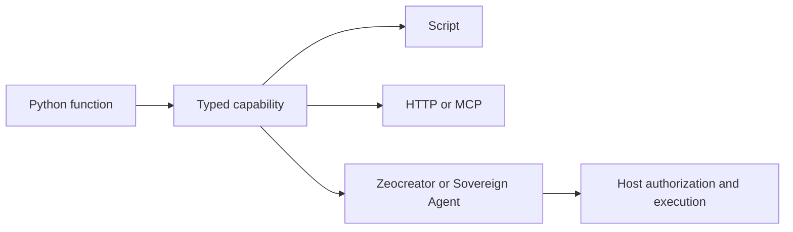

# One capability. Every caller.

<!-- Teaches CLAUDE.md Rev 17; reviewed 2026-09-10: Runtime host and meeting source APIs. -->

<div class="hero" markdown>
ZeoCore gives Python functions typed inputs, explicit effects and structured results,
so scripts, services, Zeocreator and Sovereign Agent can call the same capability.
</div>

[Start in ten minutes](../QUICKSTART.md){ .md-button .md-button--primary }
[Connect a service](integrations/README.md){ .md-button }
[Register a provider](how-to/provider-registration.md){ .md-button }

```bash
uv pip install "zeocore==0.11.0"
```

Python **3.14+** · Package `zeocore` · Import `zeo_core`

<div class="grid cards" markdown>

- **Build a capability**

    Give a function an identity, request, response and declared effects.

    [Learn capability authoring](tutorials/capability-authoring.md)

- **Automate your newsletter**

    Work with marketing email, campaigns and sequences through bounded integrations.

    [HubSpot](tutorials/hubspot-marketing.md) · [Kit](tutorials/kit-marketing.md)

- **Separate test and production**

    Follow exact key-acquisition steps and distinct account, credential and resource tracks.

    [Set up your integration](integrations/README.md)

- **Produce verified artifacts**

    Convert and execute notebooks, inspect receipts, and stage authored outputs.

    [Run the authoring reference](integrations/authoring-reference.md)

</div>

## How it fits together



Capabilities describe and perform bounded work. Your host supplies authorization,
credentials, scheduling and delivery policy. Marketing examples start offline;
real sending requires explicit setup and host authorization.

## New in 0.11.0

The [Runtime host](how-to/runtime-host.md) and [meeting adapters](integrations/meetings.md)
are available from 0.11.0. Run these examples from the matching `v0.11.0` checkout:

```bash
uv pip install "zeocore[runtime-host]==0.11.0"
python examples/runtime_host_catalogue_v1.py
python examples/meeting_request_v1.py
```

These examples prepare real catalogues and request bytes offline; they do not
create admission or call providers. Start with [provider registration](how-to/provider-registration.md)
for terminology and setup, then follow the protocol guide for trusted host wiring.
Runtime owns admission, operation state and artifact access. ZEOconnect owns
connector credentials and authorized dispatch. Cross-system acceptance remains
required before deploying the generic host.

## Explore the library

| You want to… | Start here |
| --- | --- |
| Understand the model | [Concepts](concepts.md) and [glossary](glossary.md) |
| Run working examples | [Example catalog](../examples/README.md) |
| Look up supported imports | [Public API map](reference/api.md) |
| Inspect signatures and docstrings | [Generated API reference](reference/generated.md) |
| Upgrade to 0.11.0 | [Release notes](../RELEASE_NOTES.md) |
| Use complete agent projects | [Sovereign Agent Resources](https://github.com/profrodai/sovereign-agent-resources) |

## Runnable examples

Start with the [example catalog](../examples/README.md), which states which
examples are offline and which need optional dependencies or account setup.

## Release 0.10.0 workflows

Explore [managed environments](integrations/environments.md),
[native profiles](tutorials/zeoconnect-hosted-profile.md),
[Gemini image requests](integrations/gemini-images.md) and
[notebook authoring](integrations/authoring-reference.md).
The [learning path](learning-path.md) puts the complete guides in order.
